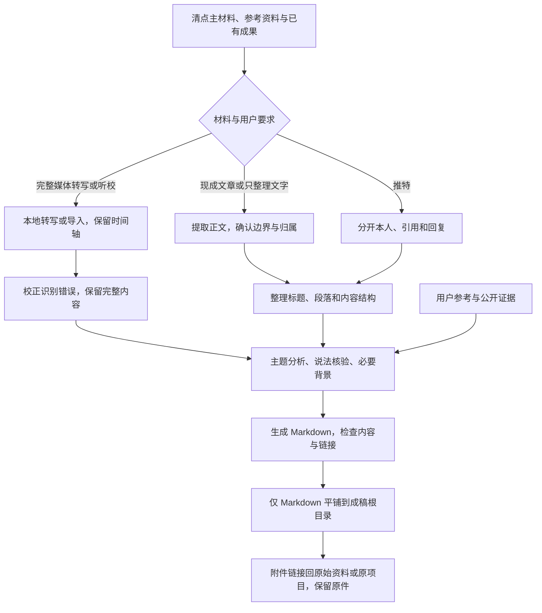

# Markdown 资料库处理流程

视频转写与现成文字采用不同的工作重点；最终都生成便于阅读和追溯的 Markdown。

普通文字连续完成；不默认逐字校对，不套用媒体分段或校订关卡。只有提取异常、OCR错误或用户要求校对时，才做必要文字修正。保留论证、例子和限定条件，内容整理不是短摘要。

媒体完整转写不超过 90 分钟默认 continuous，长媒体未选模式才询问；技术段与用户停顿独立，旧 staged 暂停点继续尊重。视频画面单独按用户选择处理。

| 分支 | 主要成果 | 检查重点 |
|---|---|---|
| 现成文字 | 正文整理、分析、背景、说法核验 | 正文范围、内容完整、归属与证据 |
| 媒体转写 | 当前 02 全文及分析核验 | 识别校正、时间轴、全文覆盖 |
| 归档 | 成稿根目录中的单个 Markdown | 重定位后的正文与实际附件链接 |

参考资料与图片留在原项目，成稿不为每篇创建目录或复制附件。仅为修复本地链接产生的字节差异不等于改写正文。
